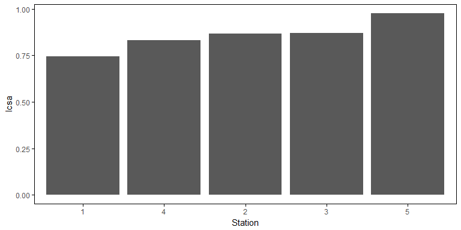
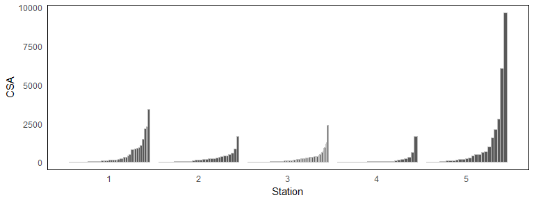
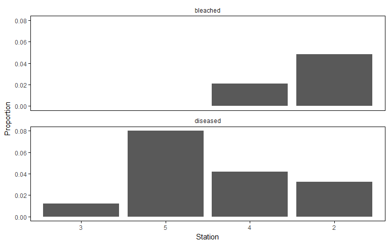
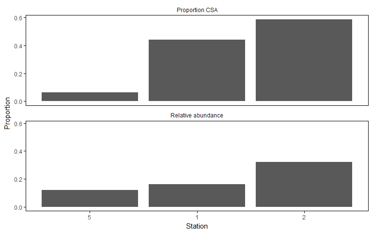

# CoralBCG: quantitative rules for the coral biological condition gradient
Marcus W. Beck, beck.marcus@epa.gov  

[](https://ci.appveyor.com/project/fawda123/coral_bcg)
[](https://travis-ci.org/fawda123/coral_bcg)

This is the development repository for the CoralBCG package. Functions within this package can be used to estimate quantitative rules for the coral biological condition gradient.

## Installing the package

The development version of this package can be installed as follows:


```r
install.packages('devtools')
library(devtools)
install_github('fawda123/CoralBCG')
library(CoralBCG)
```

## Using the functions


Data should have the following format:

```r
head(crl_dem)
```

```
##   station_code        species_name ColonyID MaxDiam PerpDiam Height
## 1            2 Siderastrea radians        1       4        4      1
## 2            2 Eusmilia fastigiata        1       5        4      3
## 3            2    Agaricia humilis        6       6        4      2
## 4            2  Madracis pharensis        1       6        5      2
## 5            2  Porites astreoides        2       6        4      2
## 6            2   Madracis decactis        1       7        4      5
##   MortOld MortNew Bleached Diseased
## 1       0       0        P        A
## 2       0       0        N        A
## 3       0       0        N        A
## 4       0       0        N        A
## 5       0       0        N        A
## 6       0      10        N        A
```

Estimate all quantitative rules with `get_stony_mets`:

```r
crl_met <- get_stony_mets(crl_dem)
```

### Percent live cover

This is estimated at each station as the average live cover of all colonies at a site.  The live cover of a colony was the sum of the estimated surface area of all colonies that was reported as percent live (reciprocal of the sum of new and old percent mortality).  Surface area of each colony is estimated as follows:

 1. Identify height, maximum diameter, and perpendicular diameter
 2. Convert maximum and perpendicular diameter to a single value as the diameter of a ciricle with the same area as an ellipse based on the major/minor axes
 3. Use morphological conversion factors if species name is not found in equation list, where conversion factors are based on Table J-1 in EPA/600/R-13/350 (same as Table 3-2 in EPA/600/R-12/029) and the equation 
$$
CSA = \pi \cdot r^2 \cdot M 
$$
$$
r = \frac{height + diam/2}{2}
$$

Percent live cover at a station is then estimated as:

1. For each colony, multiply the total surface area by the inverse of the mortality estimate
$$
LCSA = CSA \cdot \left(1 - \left(MortOld + MortNew\right)/100\right)
$$
2. For each station, total live percent cover is sum of live surface area for $i = 1$ to $n$ colonies, divided by the sum of total surface area for all colonies (note that this could be different information from the average of percent live surface area per colony)
$$
total \space LCSA = \frac{\sum_{i = 1}^n LCSA_i}{\sum_{i = 1}^n CSA_i}
$$


```r
mythm <- theme_minimal() +
  theme(
    legend.position = 'top', 
    legend.title = element_blank(),
    panel.border = element_rect(colour = "black", fill = NA, size = 0.5),
    axis.ticks.x = element_line(),
    axis.ticks.y = element_line(),
    axis.ticks.length = unit(.1, "cm"), 
    panel.grid.major = element_blank(), 
    panel.grid.minor = element_blank()
  )

# barplot of lcsa
toplo <- arrange(crl_met, lcsa) %>% 
  mutate(station_code = factor(station_code, levels = as.character(station_code)))
ggplot(toplo, aes(x = station_code, y = lcsa)) +
  geom_bar(stat = 'identity') +
  mythm + 
  scale_x_discrete('Station')
```

<!-- -->

### Mortality of large reef-building genera

Mortality of large reef-building genera (*Acropora*, *Colpophyllia*, *Dendrogrya*, *Orbicella*, *Pseudodiploria*) was estimated as the average recent mortality at the site for all colonies/individuals within the genera. This value is reported as the average percent live surface area and was estimated similarly as above.


```r
totab <- select(crl_met, station_code, lrg_mort, lrg_abu) %>% 
  filter(lrg_mort > 0) %>% 
  arrange(lrg_mort) %>% 
  rename(
    Station = station_code, 
    `Large species abundance` = lrg_abu, 
    `Average recent mortality` = lrg_mort
  )
pander::pander(totab)
```


--------------------------------------------------------------
 Station   Average recent mortality   Large species abundance 
--------- -------------------------- -------------------------
    3              0.003273                     55            

    5              0.004545                     11            

    2               0.018                       10            

    1              0.01818                      11            
--------------------------------------------------------------

### Frequency distribution of colony size

This describes the variation in colony sizes at a site, where sites with higher BCG levels have a more even distribution of small to large colonies.  Presence of recruits is also taken into consideration for BCG quality (not shown in plots).  The plot below shows the stations with bars for smallest to largest colony at a station.


```r
crl_dem$csa <- with(crl_dem, est_3d(species_name, Height, MaxDiam, PerpDiam))
toplo <- get_col_sz(crl_dem, raw_out = T) %>% 
  arrange(station_code, csa) %>% 
  mutate(
    species_name = factor(species_name),
    species_name = as.numeric(species_name)
    ) %>%
  unite('statcol', station_code:ColonyID, remove = F) %>% 
  mutate(statcol = factor(statcol, levels = as.character(statcol)))

ggplot(toplo, aes(x = station_code, y = csa, group = statcol)) + 
  geom_bar(stat = 'identity', colour = 'grey', position = 'dodge') + 
  mythm +
  theme(legend.position = 'top') + 
  xlab('Station') + 
  scale_y_continuous('CSA')
```

<!-- -->

```r
# Size distribution spread
get_col_sz(crl_dem)
```

```
##    station_code      var      val
## 1             1  sz_dist 2.891851
## 2             2  sz_dist 2.845603
## 3             3  sz_dist 3.721674
## 4             4  sz_dist 2.159184
## 5             5  sz_dist 2.101650
## 6             1 recruits 1.000000
## 7             2 recruits 0.000000
## 8             3 recruits 0.000000
## 9             4 recruits 0.000000
## 10            5 recruits 1.000000
```

### Sensitive and rare species

This metric assesses the species composition and diversity of sensitive, rare species present (*Eusmilia*, *Isophyllastrea*, *Isophyllia*, *Mycetophyllia*, *Scolymia*) in the appropriate habitat type. The metric could be evaluated at each site as a richness estimate for the sensitive species, sum of the relative abundances, or as a diversity measure that accounts for both richness and abundance. Relative abundance was estimated as the number of observations for a species divided by the total number of observations. Diversity of sensitive species was estimated as Shannon diversity:

$$
D = -\sum_{i = 1}^{n} p_i \cdot log\left(p_i\right) 
$$
where i of n species are observed and p_i is the proportional abundance of each.  Only sixteen stations had sensitive species.


```r
# summary table for those with sens species
totab <- select(crl_met, station_code, sr_rich, sr_rel_abu, sr_div) %>% 
  filter(sr_rich > 0) %>% 
  rename(
    Station = station_code, 
    Richness = sr_rich, 
    `Relative abundance` = sr_rel_abu, 
    Diversity = sr_div
    )
pander::pander(totab)
```


-----------------------------------------------------
 Station   Richness   Relative abundance   Diversity 
--------- ---------- -------------------- -----------
    2         1            0.03226             0     

    3         1             0.0119             0     
-----------------------------------------------------

### Disease, bleaching

Disease was recorded for individual corals as present/absence bleaching was recorded as absent, partial, and total. Both were summarized at each site as percent of individuals with disease or bleaching, i.e., sum of presence divided by total individuals.  Indidividuals with partial bleaching were assigned a value of 0.5.


```r
toplo <- filter(crl_met, diseased != 0 | bleached != 0)  %>% 
  arrange(bleached) %>% 
  mutate(station_code = factor(station_code, levels = as.character(station_code))) %>% 
  gather('var', 'val', bleached:diseased)

ggplot(toplo, aes(x = station_code, y = val)) + 
  geom_bar(stat = 'identity') + 
  facet_wrap(~var, ncol = 1) + 
  scale_y_continuous('Proportion') + 
  scale_x_discrete('Station') + 
  mythm
```

<!-- -->

### Dominance of *Orbicella* and *Acropora*

Dominance of *Orbicella* and *Acropora* genera was assessed as the sum of relative abundances of species at each site. This metric also refers to structural dominance of the species so it was also assessed as the sum of the surface area of all species in the genera divided by the total.


```r
toplo <- filter(crl_met, acrorb_rel_abu != 0 & acrorb_csa != 0) %>% 
  arrange(acrorb_csa) %>% 
  mutate(station_code = factor(station_code, levels = as.character(station_code))) %>% 
  rename(
    `Relative abundance` = acrorb_rel_abu,
    `Proportion CSA` = acrorb_csa
  ) %>% 
  gather('var', 'val', `Relative abundance`:`Proportion CSA`)
ggplot(toplo, aes(x = station_code, y = val)) + 
  geom_bar(stat = 'identity') + 
  facet_wrap(~var, ncol = 1) + 
  scale_y_continuous('Proportion') + 
  scale_x_discrete('Station') + 
  mythm
```

<!-- -->
